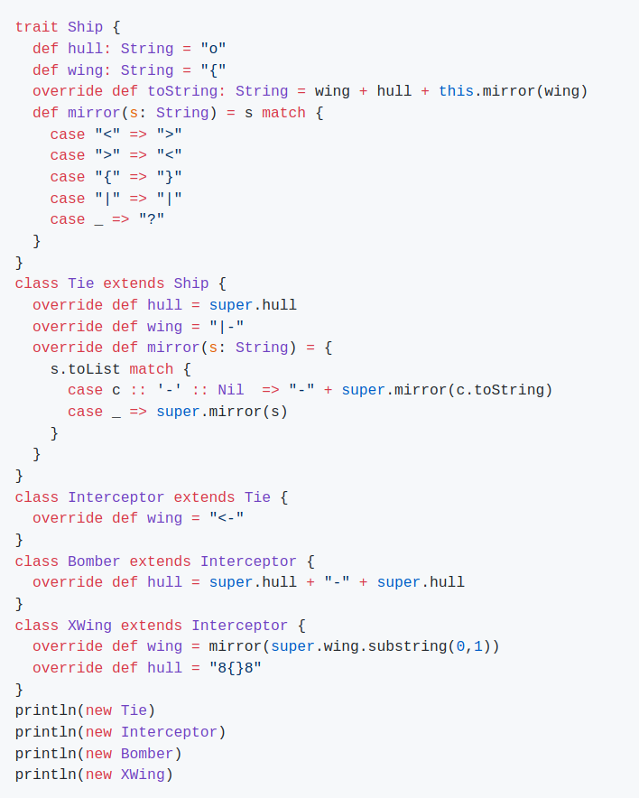

Midterm retake (23.1.2020)
--------------------------

## Instructions

Create a new GitHub repository in [FIT-BI-OOP-191](https://github.com/FIT-BI-OOP-191) named `midterm-retake2-<your github username>`, and make it **private**.

Upload into it a text / markdown file with your answers.

## Exercise 1

The following code snippet contains a bug. It can return the wrong value.

```scala
/**
 * Finds the last element of a list.
 * 
 * Example: lastElement(List(1,2,3,1,4,9)) == 9
 */
def lastElement[T] (l: List[T]): T = {
   assert(l != Nil)
   l match {
     case element::_ => element
     case element::tail => lastElement(tail)
   }
}
```

1. Write down an argument that causes buggy behavior along with the incorrect return value. 
2. Then, fix the bug.

## Exercise 2

What will the following code snippet print on screen? Explain why.



_Hint:_ think about which calls use dynamic dispatch and which use static dispatch.

## Exercise 3

Implement a method that checks whether two strings are of equal length, not considering whitespace. That is, for strings "abc" and "a b c" it should return true.

```scala
def equalLength(a: String, b: String) = ???
```

_Hint:_ `Char` has method `isWhitespace`.

## Exercise 4

In the game of Bananagrams players draw a letter each round and try to use the
letters they collected to arrange words on the table in front of them. In one
version of the game each letter has assigned a point value. For English these
point values are as follows:

```scala
val pointValues = Map (
  'A' -> 1, 'E' -> 1, 'I' -> 1, 'O' -> 1, 'U' -> 1, 'L' -> 1, 'N' -> 1, 
  'S' -> 1, 'T' -> 1, 'R' -> 1, 'D' -> 2, 'G' -> 2, 'B' -> 3, 'C' -> 3, 
  'M' -> 3, 'P' -> 3, 'F' -> 4, 'H' -> 4, 'V' -> 4, 'W' -> 4, 'Y' -> 4,
  'K' -> 5, 'J' -> 8, 'X' -> 8, 'Q' -> 10, 'Z' -> 10
)
``` 

To calculate the point value of a word, simply sum the values of each of the letters.
At the end of the game each player sums the values of all the words they
managed to arrange and the player with the most points wins. 

Implement a function that calculates the points scored by a single player. The
function has the following signature:

```scala
def playerPoints(words: List[String]): Int = ???
```

Use one or more of the functions from the fold family (fold, foldLeft, map,
reduce, filter, etc.) to get full points.

## Exercise 5

Given the following class Tree, implement the methods map and sum.

```scala
abstract class Tree {
  def map(f: Int => Int): Tree
  def sum: Option[Int]
}

object Empty extends Tree {
  override def map(f: Int => Int): Tree = ???
  override def sum: Option[Int] = ???
}

class Node(value: Int, left: Tree, right: Tree) extends Tree {
  override def map(f: Int => Int): Tree = ???
  override def sum: Option[Int] = ???
}
```
